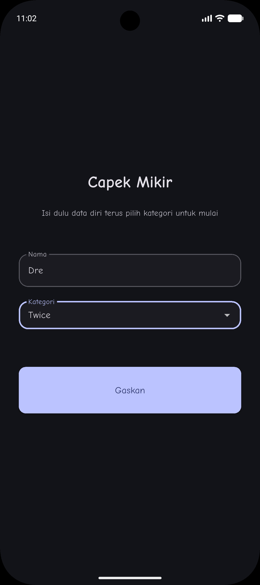
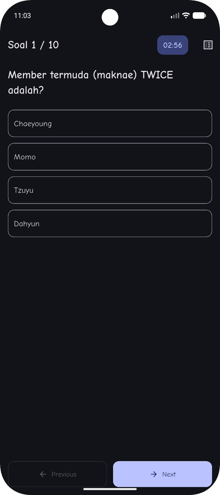
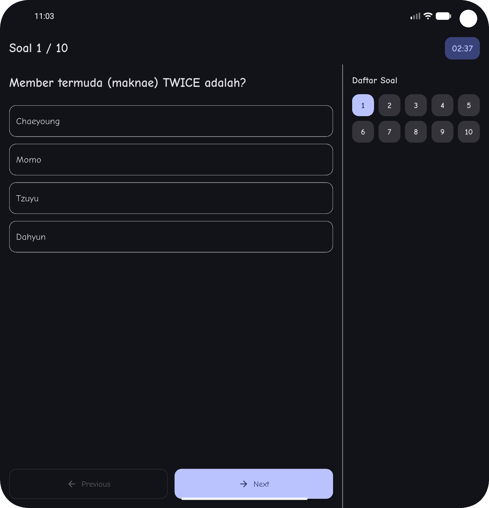
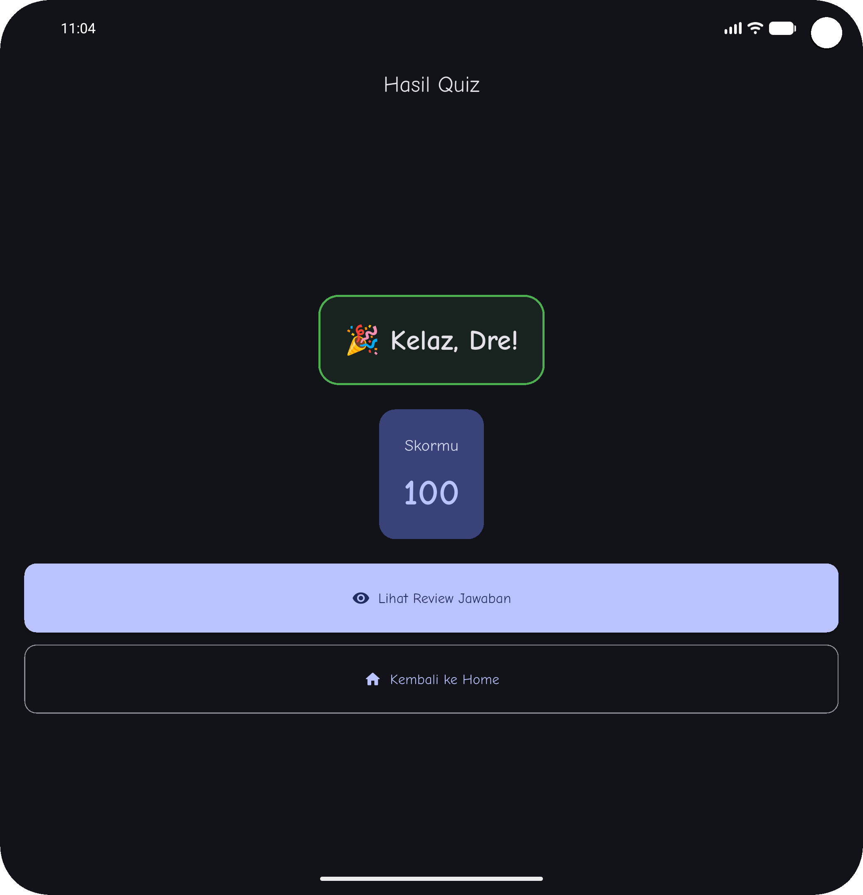
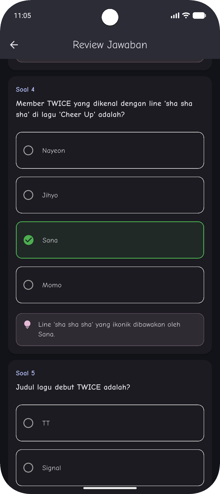
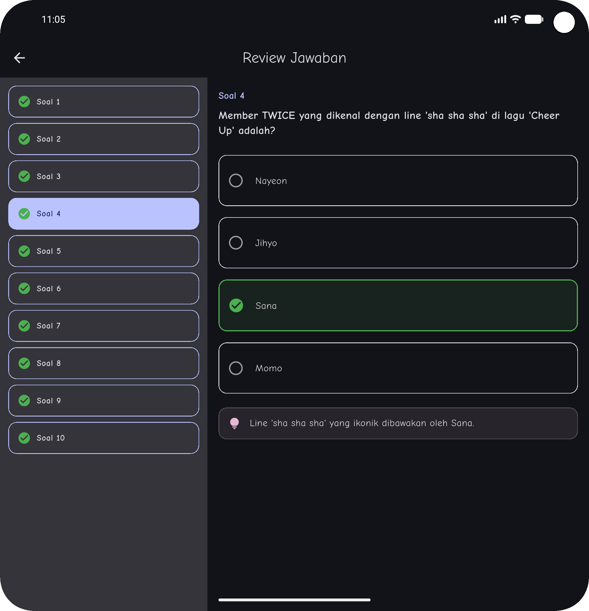

# Capek Mikir

Aplikasi kuis sederhana yang dibuat dengan Flutter.

## Informasi Mahasiswa

- **Nama:** Andreas Manatar Lumban Gaol
- **NIM:** 221401067
- **KOM:** B

## Tentang Aplikasi (Deskripsi)

**Capek Mikir** adalah aplikasi kuis yang menguji pengetahuan pengguna dalam berbagai kategori. Aplikasi ini dibuat sebagai proyek untuk Ujian Tengah Semester (UTS).

## Fitur

*   **Kuis Berbasis Kategori:** Pengguna dapat memilih dari beberapa kategori kuis.
*   **Pertanyaan Acak:** Setiap sesi kuis mengambil 10 pertanyaan secara acak.
*   **Batas Waktu:** Setiap sesi kuis memiliki batas waktu 3 menit.
*   **Skor dan Solusi:** Pengguna dapat melihat skor dan meninjau jawaban yang benar.
*   **Tampilan Responsif:** Layar kuis dan solusi akan menyesuaikan tata letak (compact & expanded view) untuk perangkat berlayar sempit dan lebar.

## Screenshot & Video Aplikasi

### Screenshots

#### 1. Home Screen


#### 2. Quiz Screen (Responsive)
|              Compact View              |              Expanded View               |
|:--------------------------------------:|:----------------------------------------:|
|  |  |

#### 3. Score Screen


#### 4. Solution Screen (Responsive)
|                  Compact View                  |                  Expanded View                   |
|:----------------------------------------------:|:------------------------------------------------:|
|  |  |


### Video Demo

[Lihat Video Demo Aplikasi](docs/demo.webm)

*(Catatan: Klik link di atas untuk melihat video demo. Pastikan file `demo.mp4` ada di dalam folder `docs`)*


## Link Mockup/Prototype

- **Aplikasi Web:** [Capek Mikir](https://capek-mikir.sanalab.live)


## Credit Aset

*Seluruh aset yang digunakan dalam proyek ini adalah buatan sendiri atau berasal dari sumber daya open-source yang tidak memerlukan atribusi.*

## Struktur Proyek

```
lib/
├── config/
│   ├── app_theme.dart     # Tema dan styling aplikasi
│   └── router.dart        # Konfigurasi routing aplikasi
├── data/
│   └── questions_list.dart # Daftar pertanyaan kuis
├── models/
│   ├── categories.dart    # Enum untuk kategori kuis
│   └── question.dart      # Model data untuk pertanyaan
├── provider/
│   ├── app_state_provider.dart # State management untuk logika kuis
│   └── user_state_provider.dart # State management untuk data pengguna
├── screens/
│   ├── home_screen.dart     # Tampilan utama aplikasi
│   ├── quiz_screen.dart     # Tampilan saat kuis berlangsung
│   ├── score_screen.dart    # Tampilan skor setelah kuis
│   └── solution_screen.dart # Tampilan untuk melihat solusi
├── widgets/
│   └── ...                # Berisi berbagai widget kustom
└── main.dart              # Titik masuk utama aplikasi
```

## Memulai

Untuk menjalankan proyek ini, pastikan Anda telah menginstal Flutter di lingkungan pengembangan Anda.

1.  **Clone repositori:**
    ```bash
    git clone https://github.com/andreasmlbngaol/capek_mikir.git
    ```
2.  **Masuk ke direktori proyek:**
    ```bash
    cd capek_mikir
    ```
3.  **Instal dependensi:**
    ```bash
    flutter pub get
    ```
4.  **Jalankan aplikasi:**
    ```bash
    flutter run
    ```

## Dependensi

*   [flutter](https://flutter.dev/)
*   [provider](https://pub.dev/packages/provider)
*   [go_router](https://pub.dev/packages/go_router)
*   [shared_preferences](https://pub.dev/packages/shared_preferences)
